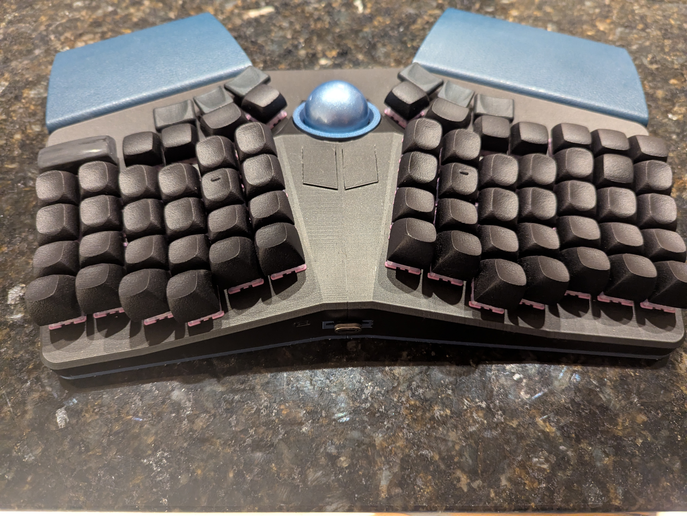
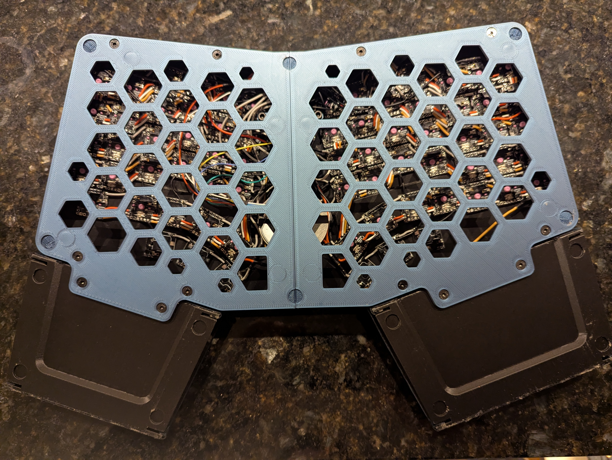

Chrumm Trackball Keyboard
===============

Chrumm Trackball is a fork of the original [Chrumm open-hardware ergonomic keyboard](https://github.com/sevmeyer/chrumm-keyboard).

This fork adds more aggressive key stagger as per my own personal preference, a second row of choc thumb keys and a trackball + mouse buttons. The encoder has been dropped. The changes made make this version incompatible with the old PCB and is now handwired with per key PCBs + a Elite-pi microcontroller. The microcontroller has been moved to the case edge so that the usb-c port is outwardly accessible removing the need for a usb-c male-female adapter cable. Finally a outwardly accessible run button has been added for convinence

I've included the python changes made to generate the second row of thumb keys but please note that there are plenty of manual editing of 3d objects post generation in order to convert the keys to choc compatible mounts, add the trackball and mouse keys and chnage the MCU mount. 

Files
-----

- [BUILD.md](BUILD.md) - Build advice
- [MATERIALS.md](MATERIALS.md) - Bill Of Materials
- [body/README.md](body/README.md) - Body generator parameters

Features
--------

Chrumm features a column staggered layout with two row thumb clusters.
The left side has an additional column, to provide dedicated arrow keys.

The body is a robust monoblock without visible screws. It has
integrated split, tent, and tilt angles, similar to commercial
ergonomic boards. The palm rests are firmly
attached, so that everything can be moved around without hassle.

The starting point STL files are generated programmatically, with a pure
Python package that has no dependencies. This fork has heavily modified the STLs post generation however.

Layout
------

Firmware
------
Assoiciated firmware can be found on [my QMK fork](https://github.com/mroukema/qmk_firmware/tree/chrumm-trackball)

Credit
------

This keyboard is a fork of the original [Chrumm open-hardware ergonomic keyboard](https://github.com/sevmeyer/chrumm-keyboard) without which this board would not exist.

Trackball mount is modified starting from the [Charybdis veichu mod](https://github.com/Bastardkb/Charybdis/tree/main/files/mods/veichu) and [adapter ring](https://github.com/Bastardkb/Charybdis/blob/main/files/3x5%20nano/adapter_v2_top_v75.stl)

Gallery
-------

